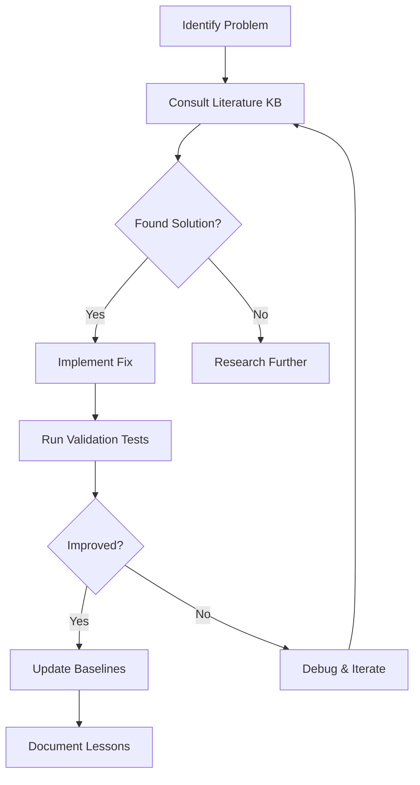

# Horn Physics Literature Knowledge Base

**Purpose**: Curated reference material for improving Viberesp's horn physics model to match Hornresp accuracy.

**Status**: Active development - organized by priority based on validation test results.

**Location**: `/Users/fungj/.viberesp/literature/` (gitignored)

---

## Problem Context

Viberesp's physics model shows severe disagreement with Hornresp reference simulations:

| Test Case | Description | Current RMSE | Target | Priority |
|-----------|-------------|--------------|--------|----------|
| case3 | Front chamber horn | **34.39 dB** | 4-6 dB | 🔴 **1** |
| case4 | Complete front-loaded | **35.83 dB** | 5-7 dB | 🔴 **1** |
| case1 | Straight exponential horn | 13.56 dB | 3-5 dB | 🟡 **2** |
| case2 | Horn with rear chamber | 9.21 dB | 2-4 dB | 🟢 **3** |

**Root Cause**: Viberesp uses **infinite horn approximation** while Hornresp implements Olson's **finite horn model**.

---

## Knowledge Base Structure

```
.
├── README.md                    # This file - overview and navigation
├── 01_front_chamber_helmholtz/  # 🔴 Priority 1: Fix 34 dB errors
├── 02_finite_horn_theory/       # 🟡 Priority 2: Fix 13 dB error
├── 03_rear_chamber_coupling/    # 🟢 Priority 3: Fix 9 dB error
├── 04_radiation_impedance/      # Foundation for all horns
└── 05_complete_system/          # Full system integration
```

---

## Priority 1: Front Chamber Helmholtz Resonance 🔴

**Goal**: Fix catastrophic 34-35 dB errors in case3 and case4.

**Key Literature**: Kolbrek, "Analysis of Front Loaded Low Frequency Horn Loudspeakers" (AES 2018)

**Topics**:
- Helmholtz resonance frequency: `f_h = (c/2π)√(S_throat/(V_front×L_eff))`
- Multi-mode standing wave resonances
- Chamber-to-throat coupling
- Reactance annulling method

**Files**:
- `kolbrek_aes2018.md` - Paper summary with extracted equations
- `helmholtz_resonance.md` - Helmholtz resonance physics
- `multi_mode_resonance.md` - Standing wave modes in chambers
- `implementation_notes.md` - How to modify `front_loaded_horn.py:592-637`

**Expected Impact**: Reduce case3/4 RMSE from 34-35 → 4-6 dB

---

## Priority 2: Finite Horn Theory 🟡

**Goal**: Fix 13 dB error in straight exponential horn (case1).

**Key Literature**: Kolbrek, "Horn Theory: An Introduction, Part 1 & 2"

**Topics**:
- Finite vs infinite horn approximation
- Transmission line modeling: `Z_throat = Z_char × coth(γ×L_eff)`
- Complex propagation constant: `γ = sqrt(m²/4 - k²)`
- Mouth reflection effects
- Below-cutoff transmission

**Files**:
- `kolbrek_horn_theory.md` - Finite horn transmission line equations
- `throat_impedance.md` - Throat impedance derivation
- `mouth_reflections.md` - Finite length effects
- `implementation_notes.md` - How to modify `exponential_horn.py:126-140`

**Expected Impact**: Reduce case1 RMSE from 13.56 → 3-5 dB

---

## Priority 3: Rear Chamber Coupling 🟢

**Goal**: Improve 9 dB error with rear chamber present (case2).

**Key Literature**: Olson, Beranek, general horn theory

**Topics**:
- Rear chamber compliance effects
- Driver-horn impedance interaction
- Parallel impedance coupling

**Files**:
- `rear_chamber_impedance.md` - Chamber compliance physics
- `driver_horn_coupling.md` - Impedance chain interaction
- `implementation_notes.md` - Code modifications

**Expected Impact**: Reduce case2 RMSE from 9.21 → 2-4 dB

---

## Foundation Topics

### Radiation Impedance (Priority 4)

**Key Literature**: Beranek, "Acoustics" (1954/1986)

**Topics**:
- Circular piston radiation impedance: `Z_rad = (ρ₀c/S_m) × [R₁(ka) + j×X₁(ka)]`
- Bessel and Struve functions
- Mouth boundary conditions

**Note**: Already implemented in Viberesp but may need verification.

### Complete System Integration (Priority 5)

**Topics**:
- Electrical → Mechanical → Acoustic impedance chain
- Phase coherence validation
- System-level testing methodology

---

## Critical Viberesp Files

| File | Lines | Issue |
|------|-------|-------|
| `exponential_horn.py` | 126-140 | Infinite horn approximation (finite needed) |
| `front_loaded_horn.py` | 592-637 | Broken front chamber (Helmholtz needed) |
| `base_horn.py` | 399-414 | Radiation impedance (verify Beranek) |
| `test_synthetic_cases.py` | - | Validation test suite |

---

## Usage Guide

### For Learning (Reference Mode)

1. Start with README in each priority directory
2. Read paper summaries (e.g., `kolbrek_aes2018.md`)
3. Study equation derivations (e.g., `helmholtz_resonance.md`)
4. Review `implementation_notes.md` for code context

### For Implementation (Coding Mode)

1. **Read** the relevant `implementation_notes.md`
2. **Understand** the current implementation in Viberesp
3. **Extract** equations from literature markdown files
4. **Implement** changes incrementally
5. **Validate** against synthetic test fixtures
6. **Update** baselines if improved

---

## Literature Sources

### Primary Papers (Tier 1 - Critical)
1. **Kolbrek, "Horn Theory: An Introduction"** (audioXpress)
   - https://www.grc.com/acoustics/an-introduction-to-horn-theory.pdf

2. **Kolbrek, "Analysis of Front Loaded Low Frequency Horn Loudspeakers"** (AES 2018)
   - Available through AES library or academic request

3. **Beranek, "Acoustics"** (1954/1986)
   - https://monoskop.org/images/f/f1/Beranek_Leo_L_Acoustics_no_OCR.pdf

4. **Olson, "Acoustical Engineering"** (1957)
   - http://cyrille.pinton.free.fr/electroac/lectures_utiles/son/Olson.pdf

### Supporting Papers (Tier 2-3)
5. **Keele, "Low-Frequency Horn Design Using Thiele/Small Driver Parameters"** (AES 1977)
   - https://dbkeele.com/technical-papers-2

6. **Leach, "On the Specification of Moving-Coil Drivers..."** (JAES)

---

## Workflow



---

## Contributing

When adding new knowledge:

1. **Organize by priority** - Put in appropriate numbered directory
2. **Include equations** - Use LaTeX syntax in markdown
3. **Link to sources** - Always cite original papers
4. **Add code snippets** - Show Python implementation
5. **Update README** - Keep this file current

---

## Glossary

| Term | Definition |
|------|------------|
| **Helmholtz resonance** | Resonance of air mass in throat bouncing against spring of chamber compliance |
| **Finite horn** | Horn of finite length with mouth reflections (realistic) |
| **Infinite horn** | Theoretical simplification assuming horn continues infinitely |
| **Throat impedance** | Acoustic impedance at horn throat (driver-horn interface) |
| **RMSE** | Root mean square error - measure of disagreement with reference |
| **Exponential horn** | Horn with cross-section expanding exponentially: `S(x) = S_t × e^(mx)` |

---

## Status Tracking

- ✅ Directory structure created
- ⏳ Priority 1 content (in progress)
- ⏳ Priority 2 content (pending)
- ⏳ Priority 3 content (pending)
- ⏳ Foundation topics (pending)

**Last Updated**: 2025-12-24
**Maintainer**: Viberesp development team
